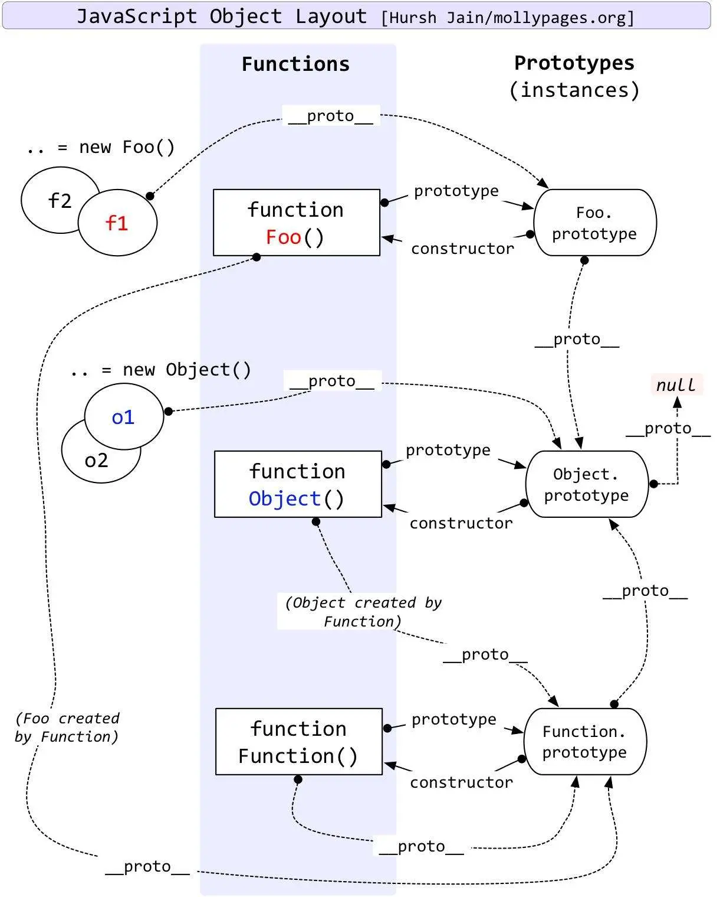

# 原型链


> 实例child若没有xx属性，则用child._proto_找构造函数father.prototype.xx(注意不会找father.xx)，再找不到就找father.prototype._proto_即object.prototype，再找object.prototype._proto_则是null
>
> 构造函数若没有xx属性,则用father._proto_找Functino.prototype的xx再找不到就找Functino.prototype._proto_即object.prototype，再找object.prototype._proto_则是null

```ts
function Person(name) {
    this.name = name
}
var p2 = new Person('king');
console.log(p2.__proto__) //Person.prototype
console.log(p2.__proto__.__proto__) //Object.prototype
console.log(p2.__proto__.__proto__.__proto__) // null
console.log(p2.constructor)//Person
console.log(p2.prototype)//undefined p2是实例，没有prototype属性
console.log(Person.constructor)//Function 一个空函数
console.log(Person.prototype)//打印出Person.prototype这个对象里所有的方法和属性
console.log(Person.prototype.constructor)//Person
console.log(Person.prototype.__proto__)// Object.prototype
console.log(Person.__proto__) //Function.prototype
console.log(Function.prototype.__proto__)//Object.prototype
console.log(Function.__proto__)//Function.prototype
console.log(Object.__proto__)//Function.prototype
console.log(Object.prototype.__proto__)//null
```


```ts
// a
function Foo () {
 getName = function () {
   console.log(1);
 }
 return this;
}
// b
Foo.getName = function () {
 console.log(2);
}
// c
Foo.prototype.getName = function () {
 console.log(3);
}
// d
var getName = function () {
 console.log(4);
}
// e
function getName () {
 console.log(5);
}

Foo.getName();           // 2
getName();               // 4
Foo().getName();         // 1
getName();               // 1
new Foo.getName();       // 2
new Foo().getName();     // 3
new new Foo().getName(); // 3

输出结果：2  4  1  1  2  3  3
```
+ Foo.getName()， Foo为一个函数对象，对象都可以有属性，b 处定义Foo的getName属性为函数，输出2；
+ getName()， 这里看d、e处，d为函数表达式，e为函数声明，两者区别在于变量提升，函数声明的 5 会被后边函数表达式的 4 覆盖；
+ Foo().getName()， 这里要看a处，在Foo内部将全局的getName重新赋值为 console.log(1) 的函数，执行Foo()返回 this，这个this指向window，Foo().getName() 即为window.getName()，输出 1；
+ getName()， 上面3中，全局的getName已经被重新赋值，所以这里依然输出 1；
+ new Foo.getName()， 这里等价于 new (Foo.getName())，先执行 Foo.getName()，输出 2，然后new一个实例；
+ new Foo().getName()， 这 里等价于 (new Foo()).getName(), 先new一个Foo的实例，再执行这个实例的getName方法，但是这个实例本身没有这个方法，所以去原型链__protot__上边找，实例.protot === Foo.prototype，所以输出 3；
+ new new Foo().getName()， 这里等价于new (new Foo().getName())，如上述6，先输出 3，然后new 一个 new Foo().getName() 的实例。

```ts
var F = function() {};
Object.prototype.a = function() {
  console.log('a');
};
Function.prototype.b = function() {
  console.log('b');
}
var f = new F();
f.a();
f.b();
F.a();
F.b()
```
>输出结果：
a
Uncaught TypeError: f.b is not a function
a
b

+ `f->f.__proto__->F.prototype->F.prototype.__proto__->object.prototype`只能访问到 Object 原型链。所以 f.a() 输出 a  ，而 f.b() 就报错了。
+ `F->F._proto_->Function.prototype->Function.prototype._proto_->object.prototype `是个构造函数，而 F 是构造函数 Function 的一个实例。因为 F instanceof  Object === true，F instanceof Function === true，由此可以得出结论：F 是 Object 和 Function 两个的实例，即 F 能访问到 a， 也能访问到 b。所以 F.a() 输出 a ，F.b() 输出 b。

```ts
function Foo(){
    Foo.a = function(){
        console.log(1);
    }
    this.a = function(){
        console.log(2)
    }
}

Foo.prototype.a = function(){
    console.log(3);
}

Foo.a = function(){
    console.log(4);
}

Foo.a();
let obj = new Foo();
obj.a();
Foo.a();
```
输出结果：4 2 1

+ Foo.a() 这个是调用 Foo 函数的静态方法 a，虽然 Foo 中有优先级更高的属性方法 a，但 Foo 此时没有被调用，所以此时输出 Foo 的静态方法 a 的结果：4
+ let obj = new Foo(); 使用了 new 方法调用了函数，返回了函数实例对象，此时 Foo 函数内部的属性方法初始化，原型链建立。
+ obj.a() ; 调用 obj 实例上的方法 a，该实例上目前有两个 a 方法：一个是内部属性方法，另一个是原型上的方法。当这两者都存在时，首先查找 ownProperty ，如果没有才去原型链上找，所以调用实例上的 a 输出：2
+ Foo.a() ; 根据第2步可知 Foo 函数内部的属性方法已初始化，覆盖了同名的静态方法，所以输出：1

```ts
function Parent() {
    this.a = 1;
    this.b = [1, 2, this.a];
    this.c = { demo: 5 };
    this.show = function () {
        console.log(this.a , this.b , this.c.demo );
    }
}

function Child() {
    this.a = 2;
    this.change = function () {
        this.b.push(this.a);
        this.a = this.b.length;
        this.c.demo = this.a++;
    }
}

Child.prototype = new Parent();
var parent = new Parent();
var child1 = new Child();
var child2 = new Child();
child1.a = 11;
child2.a = 12;
child1.change();
child2.change();
parent.show();// 1 [1,2,1] 5
child1.show();// 5 [1,2,1,11,12] 5
child2.show();// 6 [1,2,1,11,12] 5
```
+ this.b.push(this.a)，由于this的动态指向特性，this.b会指向Child.prototype上的b数组,this.a会指向child1的a属性,所以Child.prototype.b变成了**[1,2,1,11]**;
+ this.a = this.b.length，这条语句中this.a和this.b的指向与上一句一致，故结果为child1.a变为4;
+ this.c.demo = this.a++，由于child1自身属性并没有c这个属性，所以此处的this.c会指向Child.prototype.c，this.a值为4，为原始类型，故赋值操作时会直接赋值，Child.prototype.c.demo的结果为4，而this.a随后自增为5(4 + 1 = 5)。
+ child2执行了change()方法, 而child2和child1均是Child类的实例，所以他们的原型链指向同一个原型对象Child.prototype,也就是同一个parent实例，所以child2.change()中所有影响到原型对象的语句都会影响child1的最终输出结果。
+ this.b.push(this.a)，由于this的动态指向特性，this.b会指向Child.prototype上的b数组,this.a会指向child2的a属性,所以Child.prototype.b变成了**[1,2,1,11,12]**;
+ this.a = this.b.length，这条语句中this.a和this.b的指向与上一句一致，故结果为child2.a变为5;
+ this.c.demo = this.a++，由于child2自身属性并没有c这个属性，所以此处的this.c会指向Child.prototype.c，故执行结果为Child.prototype.c.demo的值变为child2.a的值5，而child2.a最终自增为6(5 + 1 = 6)。